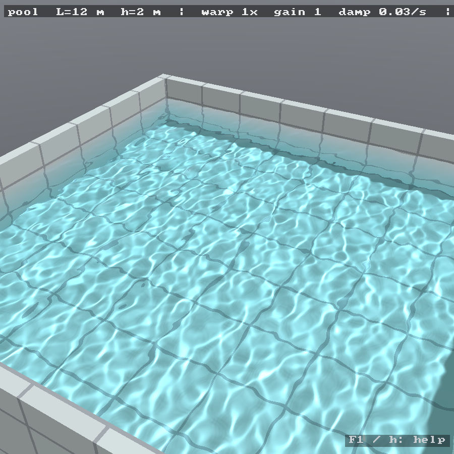
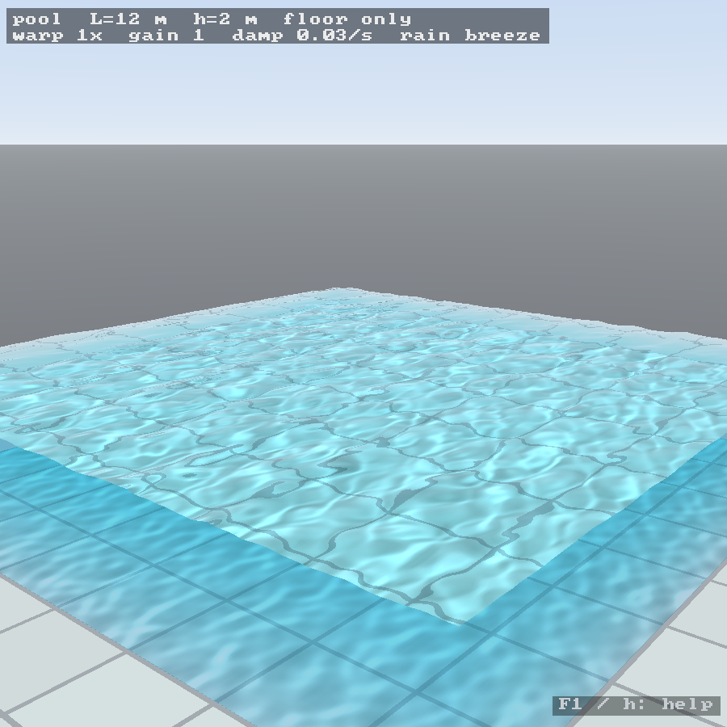
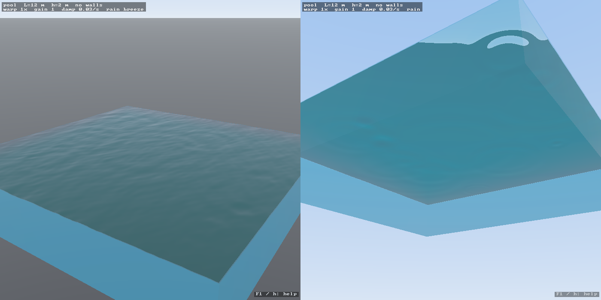

# pond

A numerically honest wave tank as screen candy. Linear dispersive water waves
(gravity + capillary, finite depth) on the surface of a rectangular or
circular basin with rigid walls, solved spectrally and advanced *exactly* in
time, then drawn as a 3-D basin — walls, floor, refraction, caustics, sky — that you can orbit and
zoom, with walls and bottom switchable to glass. A top-down CPU renderer is
kept as `--2d`.

C17. Dependencies: SDL2 (video and audio) and an OpenGL 3.3 core context (macOS ships 4.1;
Mesa/NVIDIA on Linux; WebGL2 in the browser). No GL loader library: the
handful of entry points used are fetched through `SDL_GL_GetProcAddress`
(`src/gl.h`). Same source builds for Linux, macOS and Emscripten.

## Build

    make            # native: needs SDL2 dev package (apt: libsdl2-dev, brew: sdl2)
    make test       # DCT against the O(N^2) definition; mode frequency against Airy
    make bench      # headless timings of the CPU path on a 512^2 grid
    make web        # needs emsdk on PATH; output in build/web/, serve it statically

    ./pond                                 # 512^2 grid, 1280x800 window, "pond" preset
    ./pond --basin 25x12 --depth 1.8       # any rectangle, in metres
    ./pond --shape disk --basin 10         # a round basin, 10 m across
    ./pond --hos --preset 3 --scene paddle # nonlinear, order 3 on the lowest 64x64 modes
    ./pond --scene paddle --paddle-freq 1.2      # a wavemaker at 1.2 Hz: the water picks the wavelength
    ./pond --scene paddle --paddle-span 0.12 --paddle-pos 0.25 --paddle-wall y=0
    ./pond --script demos/tour.pond        # three minutes of everything, on a loop; Escape stops it
    ./pond --cpu-caustics                  # if the GPU pass is unavailable or suspect
    ./pond --mute                          # starts silent; --no-audio opens no device at all
                                           # POND_WAV=take.wav records what you hear
    ./pond --sound bed=0.5,brown=0.3       # knobs: drops, bed, brown, breeze, harsh (1 = as designed)
    ./pond --preset 3 --scene rain,breeze  # pool, with sources already on
    ./pond --glass 1 --preset 3 --scene breeze   # floor only: bright water, caustics, no walls
    ./pond --glass 3 --cam 40,-20,1.3      # start looking up through a glass bottom
    ./pond --glass 4 --preset 4 --scene breeze   # a block of sea with no container
    ./pond --2d                            # top-down CPU renderer (no GL needed)
    ./pond --fullscreen --no-hud           # screen candy with nothing written on it
    ./pond --volume 0.3 --glass 1 --write-config   # save that as how pond starts from now on
    ./pond --nomsaa                        # if window creation fails on an odd display
    ./pond --frames 120 --snap3d shot.bmp  # scripted screenshot
    ./pond --bench 300 --preset 4 --scene breeze --snap sea.bmp

In the browser the grid defaults to 256^2; append `?grid=512` to the URL for
the finer mesh (single-threaded WASM, so budget accordingly; 512 is the cap,
the heap is fixed at 128 MB). `make web
WEB_DIR=docs` puts the build where GitHub Pages can serve it from `/docs`.
Use `h` for the help there (Firefox keeps F1 for itself); on a touch
screen, one finger is the finger, two fingers orbit and pinch-zoom.

## Controls

`F1` or `h` shows the full list in the window. In short:

| | |
|---|---|
| click / shift-click on the water | drop / big drop |
| drag on the water | finger |
| drag off the water, ctrl/alt + drag, right or middle drag | orbit the camera |
| arrow keys, or keypad `4` `6` `8` `2` | orbit the camera; held, not tapped — 75 deg/s, `shift` 3x faster, `ctrl` finer |
| `PgUp` `PgDn` | zoom, same held behaviour (a factor of 2 per second) |
| wheel, `o` / `Home` | zoom, reset camera |
| `t` | container: opaque → floor only → glass walls → glass walls + bottom → none |
| `n` | basin shape: rectangle ↔ disk (the field starts over) |
| `y` | nonlinear (HOS) correction on/off (rectangle only) |
| `m` `a`/`A` | sound on/off, volume down/up |
| `j`/`J` `u`/`U` | drop level, rain-bed level |
| `z`/`Z` `w`/`W` `e`/`E` | brown noise, breeze level, breeze harshness |
| `1` `2` `3` `4` | presets: tray 30 cm · pond 3 m · pool 12 m · sea 80 m |
| `[` `]` / `{` `}` | width / length (disk: diameter), 5 % per press, hold to sweep (live: the physics changes, the field is kept; aspect kept within 4:1) |
| `,` `.` / `\` | depth / make it square again at the same area |
| `r` `i`/`I` | rain on/off, rate |
| `b` | breeze (directional wind sea) on/off |
| `p` / `P` | wavemaker on/off / move it to the next wall (its position along the wall is kept) |
| `k`/`K` | its frequency (the wavelength follows from the dispersion relation) |
| `l`/`L` | its span: the fraction of the wall it occupies, down to a point source |
| `<` `>` | slide it along that wall (on the disk, round the rim) |

While the wavemaker is running its footprint is outlined on the water in
amber, so its place and size are visible as you change them; `d` takes that
away along with the rest of the writing on the screen. The strip of forcing
is a fraction of a percent of the basin deep, which would draw as a single
line, so the outline is given a floor of 2 % of the basin — it marks where
the paddle is, not the exact contour of the forcing.

The frequency is held inside the band the basin can answer: from its lowest
mode ($k=\pi/L$) up to eight cells per wavelength. Below the first mode
nothing resonates and the paddle looks broken — `tests/test_paddle.c` drives
a 3 m tank at half its lowest frequency for 20 s and gets 2000 times less
water than driving at it.
| `-` `=` | time warp |
| `x`/`X` | extra uniform damping |
| `g`/`G` `f` | display gain, floor pattern |
| `d` | hide / show the settings box (the help hint goes with it: a clean frame for screenshots) |
| `F11`, `alt`+`enter` | full screen; `esc` leaves it before it quits |
| `c` `space` `s` `q` | clear, pause, screenshot (bmp), quit |

In `--2d` mode the wheel is the time warp, `v` toggles a height-map view and
`h` prints the help to the terminal.

## Parameters, and the configuration file

Everything that can change while the program runs is a named parameter:
booleans, enumerations, reals. Each has a getter and a setter on the running
program (the setter carrying whatever side effects keep things consistent), a
range, and a nudge — the step a key press takes. Keys nudge; the config file
and the command line set; scripts, when they come, will tween. All of them
land in the same place, `src/param.c`, and `--list-params` prints the lot:

    $ ./pond --list-params
    preset         2          tray/pond/pool/sea      tray 30 cm, pond 3 m, pool 12 m, sea 80 m; ...
    shape          rect       rect/disk               rect or disk
    width          3          0.05 .. 1000            basin width, metres (disk: the diameter)
    ...
    paddle-freq    2.04257    0.001 .. 10000          wavemaker frequency, Hz (held inside ...)
    paddle-wall    x=0        x=0/x=Lx/y=0/y=Ly       which wall it is on (disk: the rim)
    ...
    yaw            35         0 .. 360                camera yaw, degrees
    sound.harsh    0.15       0 .. 4                  gusts and rustle in the breeze

Every name is a `--name value` option (booleans take no value; `--no-name`
turns one off), a line in the config file, and — for the ones with a key —
a key. So these are the same:

    ./pond --paddle --paddle-freq 1.2 --paddle-span 0.15 --glass floor --yaw 60 --no-hud

    # in ~/.config/pond/pond.conf
    paddle      = on
    paddle-freq = 1.2
    paddle-span = 0.15
    glass       = floor
    yaw         = 60
    hud         = off

A handful of things have to be known before the program exists and are not
parameters: `grid`, `window`, `mode` (3d or 2d), `msaa`, `cpu-caustics`,
`no-audio`, `hos-nc`, `hos-order`, and the basin it starts with (`preset`,
`shape`, `basin`/`width`/`length`, `depth`, so the wave is built once).
The old spellings — `--2d`, `--nomsaa`, `--hos`, `--scene rain,paddle`,
`--cam Y,P,D`, `--sound bed=0.5,brown=0.3` — still work.

Settings are read three times over: built-in defaults, then the config file,
then the command line, each overriding the one before. The file is the first
of `$POND_CONFIG`, `$XDG_CONFIG_HOME/pond/pond.conf`,
`~/.config/pond/pond.conf`, `~/.pondrc`, `./pond.conf` that exists;
`--config FILE` names another and `--no-config` ignores all of them.

You do not have to write one by hand. `--write-config` dumps the settings as
they stand — the creation settings, then every parameter's value, grouped
and commented with the help text above — so the command line is also the
editor:

    ./pond --volume 0.3 --sound brown=0.4,harsh=0.6 --glass floor --write-config
    wrote /home/you/.config/pond/pond.conf

Values the preset implies — width, length, depth, floor, and the default
wavemaker frequency of eight wavelengths across — are written commented
out, so a file whose `preset` you later edit follows the new preset instead
of pinning the old one's size. The format is `key = value`, one per line;
`key: value` and `key value` also work, `#` and `;` start a comment,
booleans are any of on/off, yes/no, true/false, 1/0, enumerations take their
names or a number, reals accept `%`, and `-` and `_` are the same character
in a key. Unknown keys are reported with their line number and skipped, so
an old file still starts the program. The browser build has no file to read:
there `?grid=N` in the URL is the only setting.

## Scripts

A script is the config file with a time axis: one event per line, a time and
then parameter settings, run against the same table the keys nudge.

    # demos/tour.pond, abridged
    at 0     clear  preset 2  rain on  rain-rate 1.5
    at 0     camera 35,42,1.5
    at 0     say "a pond, three metres across, in the rain"
    at 2     yaw += 90 over 30             # a quarter turn, taking thirty seconds
    at 20    rain off  paddle on  paddle-freq 1.2
    at 35    paddle-freq 2.4 over 8        # tweened, eased
    at 50    paddle-span 0.12 over 6
    +8       paddle-pos 0.15 over 12       # eight seconds after the line before
    at 110   clear  shape disk  paddle-span 1
    at 180   loop

`at T` is seconds from the start, `+T` seconds after the previous line, and
a line with no time shares the previous line's. Every parameter name is a
verb; a value may be absolute or relative (`+=`, `-=`), and a number may take
`over T` to get there smoothly. The other verbs: `drop X,Y [SIZE]` or
`drop random`, `clear`, `camera Y,P,D [over T]`, `say "text"` (shown under
the HUD), `loop`, `end`. Times are wall-clock, so a script can change the
time warp itself. `#` starts a comment.

    ./pond --script demos/tour.pond

Two rules. The person wins: a key on a parameter the script is tweening
cancels that tween, and everything else the script does carries on.
And `Escape` backs out one layer at a time — the script, then full screen,
then the program. Scripts do not clear the water between events unless told
to; the old waves decaying under the new ones is the good part. (Do clear
before shrinking a basin, though: 80 m of sea in a 3 m pond is a tsunami.)

`demos/` has five: `tour` (a bit of everything, three minutes, loops),
`wavemaker` (frequency, span, position, walls), `rings` (the disk with its
rim as the wavemaker), `storm` (the sea under a rising and falling wind),
`dispersion` (one drop in a still pool, then the same in the tray where the
short waves are the fast ones). `tests/test_script.c` runs every one of them
headless, twice round.

## What it computes

### The problem

Incompressible, irrotational flow of water of uniform depth $h$ in a basin
$\Omega$ with vertical walls. The velocity is $\mathbf u = \nabla\phi$, the free
surface is $z = \eta(\mathbf x, t)$ with $\mathbf x = (x, y)$, and

$$
\nabla^2 \phi = 0 \quad\text{in } -h < z < \eta,
\qquad
\frac{\partial\phi}{\partial z} = 0 \text{ at } z=-h,
\qquad
\frac{\partial\phi}{\partial n} = 0 \text{ on the walls}.
$$

At the free surface, the kinematic condition (the surface moves with the
fluid) and the dynamic condition (Bernoulli, with surface tension $\sigma$
and density $\rho$):

$$
\eta_t + \nabla_{\!h}\phi\cdot\nabla_{\!h}\eta = \phi_z,
\qquad
\phi_t + \tfrac12|\nabla\phi|^2 + g\eta
 - \frac{\sigma}{\rho}\,\nabla_{\!h}\!\cdot\!\frac{\nabla_{\!h}\eta}{\sqrt{1+|\nabla_{\!h}\eta|^2}} = 0
\qquad\text{at } z = \eta .
$$

### Linearisation and separation

For small steepness $|\nabla\eta| \ll 1$ the quadratic terms drop and the
surface conditions can be applied at $z = 0$:

$$
\eta_t = \phi_z, \qquad \phi_t = -g\eta + \frac{\sigma}{\rho}\nabla_{\!h}^2\eta
\qquad\text{at } z = 0 .
$$

Everything is now linear with $z$-independent coefficients, so separate
$\phi = \Phi(\mathbf x)\,Z(z)\,T(t)$. Laplace's equation splits into

$$
\nabla_{\!h}^2\Phi + k^2\Phi = 0 \quad\text{in }\Omega,\qquad \partial_n\Phi = 0 \text{ on } \partial\Omega,
\qquad\qquad
Z'' = k^2 Z,\quad Z'(-h)=0 \;\Rightarrow\; Z = \cosh k(z+h).
$$

The horizontal part is the Neumann eigenproblem of the basin. Its
eigenfunctions $\Phi_n$ with eigenvalues $k_n^2$ form an orthogonal basis for
functions on $\Omega$, and — this is the whole point — the shape of the basin
enters *only* through them. Expand

$$
\eta(\mathbf x,t) = \sum_n a_n(t)\,\Phi_n(\mathbf x),
\qquad
\phi(\mathbf x,z,t) = \sum_n b_n(t)\,\Phi_n(\mathbf x)\,\frac{\cosh k_n(z+h)}{\cosh k_n h},
$$

and the two surface conditions become, mode by mode,

$$
\dot a_n = k_n\tanh(k_n h)\, b_n,
\qquad
\dot b_n = -\Big(g + \frac{\sigma k_n^2}{\rho}\Big)\, a_n ,
$$

i.e. every mode is an independent harmonic oscillator,

$$
\ddot a_n + \omega_n^2 a_n = 0,
\qquad
\boxed{\;\omega_n^2 = \Big(g k_n + \frac{\sigma k_n^3}{\rho}\Big)\tanh(k_n h)\;}
$$

with the exact solution $a_n(t) = a_n(0)\cos\omega_n t + \dfrac{\dot a_n(0)}{\omega_n}\sin\omega_n t$.
This is Airy's dispersion relation with capillarity; the limits are the
familiar ones — $\omega^2 = gk$ in deep water, $\omega = k\sqrt{gh}$ in
shallow water, $\omega^2 = \sigma k^3/\rho$ for capillary ripples. The
minimum phase speed, $(4g\sigma/\rho)^{1/4} \approx 0.23$ m/s at
$\lambda \approx 1.7$ cm, is what makes a raindrop ring look the way it does.

### Damping

Viscosity is added the way Lamb does it (*Hydrodynamics* §349): for a
free-surface wave of wavenumber $k$ the amplitude decays as $e^{-2\nu k^2 t}$,
which is the leading-order effect of viscosity on an irrotational wave. To
that we add a uniform rate $\gamma_0$ standing in for wall and bottom boundary
layers. So each mode is taken to evolve as

$$
a_n(t) = e^{-\gamma_n t}\Big(A_n\cos\omega_n t + B_n\sin\omega_n t\Big),
\qquad
\gamma_n = 2\nu k_n^2 + \gamma_0 ,
$$

which is the solution of $\ddot a + 2\gamma\dot a + (\omega^2+\gamma^2)a = 0$; for
$\gamma \ll \omega$ that is the damped oscillator to $O(\gamma^2)$, and the
oscillation frequency is kept exactly at $\omega_n$ by construction.

### The integrator

The state of a mode is the pair $(A, B) = (a, \dot a/\omega)$ evaluated now.
Advancing by any $\Delta t$ is the rotation

$$
A + iB \;\longleftarrow\; (A + iB)\, e^{-\gamma\Delta t}\, e^{-i\omega\Delta t},
$$

exact for the model above, for any step size, with no stability constraint
and no numerical dispersion — the frequencies are the physical ones to
float precision. There is no time-stepping error to accumulate. Sources
are impulses: a drop adds $\Delta\eta$ (transformed into $\Delta A_n$), the
wavemaker adds $\Delta\eta_t$ (transformed into $\Delta B_n = \Delta\dot a_n/\omega_n$).
The $k = 0$ mode (the mean level) is pinned at zero.

The wavemaker is driven, not tuned: it is a strip of velocity forcing beside
one wall moving as $\cos\omega t$, and $\omega$ is what you set. It runs at
constant speed rather than constant stroke — peak velocity $u_0$, so the
stroke is $u_0/\omega$ and the acceleration $u_0\omega$. A fixed stroke would
put the radiated height in proportion to $\omega$ and leave the bottom of the
dial invisible; at constant speed the frequency knob changes the wavelength
and viscosity alone decides how the height falls away. $u_0$ is set from the
default — eight wavelengths across the basin — so that setting looks as it
always did. Its spatial spectrum is broad —
a narrow strip is broad in $k$ — but only the modes with $\omega_n\approx\omega$
grow secularly, so what you see is the wavelength the dispersion relation
answers with, $k = k(\omega)$, and nothing else. `tests/test_paddle.c` drives
a 3 m tank at 3 Hz and finds the peak mode within 1 % of $k(2\pi f)$; that
inverse is a bisection on $\omega(k)$, which is strictly increasing.

The forcing is $f(u)\,g(v)$ — a Gaussian of width `width` in the distance $u$
from the wall, a Gaussian of the paddle's span in the coordinate $v$ along it
— and the 2-D DCT-II of a separable function is the outer product of the two
1-D transforms, so the paddle never touches real space. A full-wall paddle
has $g \equiv 1$, whose transform is one non-zero coefficient, and costs the
single 1-D transform it always did; a short one costs a second transform and
a sum over the few tens of along-wall modes a Gaussian actually reaches
(0.14 ms a frame at $512^2$, worst case). It is that cheapness that makes
position and span free to move while the thing is running.

The code keeps a fixed sub-step, $\Delta t = 1/240$ s at time-warp 1, with
lazily cached powers of the per-mode rotor, so a frame of $p$ sub-steps is one
pass over the modes for any $p$; that is a convenience, not a discretisation.

### The mode bases

**Rectangle** $[0,L_x]\times[0,L_y]$: the Neumann eigenfunctions are

$$
\Phi_{mn} = \cos\frac{m\pi x}{L_x}\cos\frac{n\pi y}{L_y},
\qquad
k_{mn}^2 = \pi^2\Big(\frac{m^2}{L_x^2} + \frac{n^2}{L_y^2}\Big).
$$

Sampled at cell centres $x_i = (i+\tfrac12)\Delta x$ these are exactly the
DCT-II basis vectors, and the DCT-II/DCT-III pair is an exact orthogonal
transform on the grid, so injection and reconstruction commute with no
leakage. Makhoul's algorithm does an $N$-point DCT with one $N$-point complex
FFT plus twiddles (`src/dct.c`, radix-2). The cells need not be square.

**Disk** of radius $R$: $\Phi_{mn} = J_m(k_{mn} r)\,e^{im\theta}$ with
$J_m'(k_{mn}R) = 0$. The implementation uses the discrete counterpart; see
below.

### Rendering, for completeness

Refraction of a ray $\mathbf I$ at a surface with unit normal $\mathbf N$ into
water of index $n = 1.333$ (Snell in vector form):

$$
\mathbf T = \frac{1}{n}\mathbf I - \Big(\frac{1}{n}(\mathbf N\!\cdot\!\mathbf I) + \sqrt{1 - \tfrac{1}{n^2}\big(1-(\mathbf N\!\cdot\!\mathbf I)^2\big)}\Big)\mathbf N .
$$

Caustics are the forward map of the sun through the surface: a surface point
$\mathbf p$ lands on the floor at $\mathbf q = \mathbf p + (h+\eta)\,\mathbf T_{xz}/(-\mathbf T_y)$,
and the floor irradiance, in units of the flat-water irradiance, is
$\sum_{\text{sheets}} 1/|\det \partial\mathbf q/\partial\mathbf p|$. The code
evaluates this by splatting each cell's area at its landing point, which sums
the sheets and produces the folds automatically. Reflectance is Schlick's
approximation to Fresnel, $R = R_0 + (1-R_0)(1-\cos\theta)^5$ with
$R_0 = ((n-1)/(n+1))^2 = 0.02$; absorption along a path $s$ in water is
Beer–Lambert, $e^{-\mu s}$ per channel.

### Validity

The linear model is exact for the linearised problem and an approximation
to real water for steepness $ka \ll 1$. The default drops have slopes up to
~0.15, where Stokes corrections are a few percent; the display gain
multiplies slopes for the eye only, not in the physics. The nonlinear
correction below (`y`) takes the model to third order in steepness.

### Nonlinearity (`src/hos.c`, optional)

Keep potential flow, drop the linearisation. In Zakharov's variables — the
elevation $\eta$ and the surface potential $\psi(\mathbf x) = \phi(\mathbf x, \eta)$ —
the exact free-surface equations are

$$
\eta_t = W\,(1+|\nabla\eta|^2) - \nabla\psi\cdot\nabla\eta,
\qquad
\psi_t = -g\eta - \tfrac12|\nabla\psi|^2 + \tfrac12 W^2 (1+|\nabla\eta|^2) + \tfrac{\sigma}{\rho}\,\kappa(\eta),
$$

where $W = \phi_z$ at the surface. The High-Order Spectral method (West et
al. 1987, Dommermuth & Yue 1987) gets $W$ from $\psi$ by expanding the
Dirichlet-to-Neumann map in powers of $\eta$:

$$
\phi^{(1)} = \psi,\qquad
\phi^{(m)} = -\sum_{j=1}^{m-1}\frac{\eta^j}{j!}\,\partial_z^j\phi^{(m-j)},\qquad
W = \sum_{m=1}^{M}\sum_{j=0}^{M-m}\frac{\eta^j}{j!}\,\partial_z^{j+1}\phi^{(m)},
$$

all evaluated at $z=0$, where for a mode with vertical profile
$\cosh k(z+h)/\cosh kh$ the derivative $\partial_z^j$ is $k^j\tanh kh$ for odd
$j$ and $k^j$ for even $j$ — diagonal in mode space. Products are formed in
real space, derivatives in mode space; that is the pseudo-spectral part.

The program uses it as a correction: the linear parts of both equations are
exactly what the rotor integrates, so each frame does half its linear
sub-steps, then a Heun step of the *remainder*

$$
N_\eta = W(1+|\nabla\eta|^2) - \nabla\psi\cdot\nabla\eta - \partial_z\phi^{(1)},\qquad
N_\psi = -\tfrac12|\nabla\psi|^2 + \tfrac12 W^2(1+|\nabla\eta|^2),
$$

then the other half (Strang splitting). Only the lowest $n_c\times n_c$ modes
take part — the long, energetic waves, where nonlinearity shows — and the
products are formed on a $2n_c\times 2n_c$ grid, which dealiases the quadratic
terms exactly; a smooth cutoff over the top quarter of the band takes the
rest. The state conversion is diagonal: $\hat\psi = \hat B\,\omega/(k\tanh kh)$.
Gradients of a cosine series are sine series, and on this grid
$\sin\frac{\pi m(2i+1)}{2N} = (-1)^i\cos\frac{\pi(N-m)(2i+1)}{2N}$, so a
derivative is a DCT-III of the reversed, $k$-weighted coefficients with an
alternating sign — no separate DST. A rigid wall is a mirror symmetry of the
full equations, so the even-extended field the cosine basis represents stays
consistent under the products; the test checks that symmetry survives.

What it changes: crests sharpen and troughs flatten (the surface skewness
goes from 0 to about +0.1 in a driven pool), the frequency depends on
amplitude, driven standing waves detune from the wavemaker as they grow,
and the modes interact — energy moves across the spectrum, groups form. It
cannot break: past steepness 0.45 the step is skipped (the HUD says so).
The capillary term stays linear, and the disk stays linear — its radial
derivatives are not diagonal in that basis. Cost at $n_c = 64$: about 30
transforms of $128^2$ per frame, a few milliseconds; $n_c = 128$ is four
times that (`--hos-nc`, `--hos-order`).

Checks in `tests/test_hos.c`: the correction scales as amplitude squared
(ratio 4.00 for a doubling), a standing wave of steepness 0.1 grows a bound
second harmonic of Stokes size and keeps its energy to $4\times10^{-4}$ over
30 periods, a random sea keeps its energy to $10^{-3}$ over 10 s, and the
wall symmetry is exact.

### The disk (`src/disk.c`)

Same physics, different eigenbasis. On a disk the Neumann eigenfunctions are
$J_m(kr)e^{im\theta}$ with $J_m'(kR)=0$; in polar coordinates the Helmholtz
operator separates as

$$
\nabla_{\!h}^2 = \frac1r\frac{\partial}{\partial r}\Big(r\frac{\partial}{\partial r}\Big) + \frac{1}{r^2}\frac{\partial^2}{\partial\theta^2}.
$$

The grid is polar, $n_t$ angles × $n_r$ rings ($n_t$ = grid, $n_r$ = grid/2),
with cell centres at $\rho_i = (i+\tfrac12)/n_r$ of the radius. An FFT in
$\theta$ makes the angular part exact: mode $m$ sees $-m^2/r^2$. For the radial
part the code does not sample Bessel functions; it takes the eigenvectors of
the *discrete* radial operator on the unit disk, written in flux form so that
the centre and the wall need no special treatment:

$$
(L_m f)_i = \frac{1}{\rho_i}\,\frac{\rho_{i+1/2}(f_{i+1}-f_i) - \rho_{i-1/2}(f_i - f_{i-1})}{h^2} - \frac{m^2}{\rho_i^2} f_i,
\qquad h = 1/n_r,
$$

with $\rho_{-1/2} = 0$ (no flux through the centre) and the flux through the
outer face $\rho_{n_r - 1/2} = 1$ set to zero (rigid wall). Multiplying by
$\rho_i$ gives a symmetric tridiagonal matrix $T_m$ and the generalised
problem $T_m f = -\kappa^2 W f$ with $W = \mathrm{diag}(\rho_i)$; with
$S_m = W^{-1/2} T_m W^{-1/2}$ this is an ordinary symmetric tridiagonal
eigenproblem $S_m g = -\kappa^2 g$, $f = W^{-1/2}g$. Because $S_m$ is
symmetric its eigenvectors $G_m$ are exactly orthonormal, so the radial
transform pair

$$
c = G_m^{\!\top} W^{1/2}\hat\eta_m \qquad\text{and}\qquad \hat\eta_m = W^{-1/2} G_m\, c
$$

is exactly inverse — the disk's counterpart of the DCT's orthogonality, and
what keeps repeated injection stable. The physical wavenumber is
$k_{mn} = \kappa_{mn}/R$, so the basis is built once for the unit disk and
resizing the basin only rebuilds the $\omega$ table. Eigenvalues by implicit
QL, eigenvectors by inverse iteration; $\kappa_{mn}$ agrees with the Bessel
roots to $10^{-7}$ for the lowest modes and $10^{-4}$ at the fifth
(`tests/test_disk.c`), as an $O(h^2)$ scheme should. The basis
($M \times n_r \times n_r$ floats, 67 MB at 512 × 256) takes about a second.

Per frame the disk costs $n_r$ complex FFTs of length $n_t$ plus one
$n_r\times n_r$ matrix–vector product per angular mode and plane; with the
products written in explicit 4-lane vectors (`vector_size`, which maps to
SSE, NEON and wasm SIMD) that is about the same as the rectangle's DCT, and
memory-bound. Radial modes beyond the grid's radial Nyquist,
$\kappa > \pi n_r$ — eigenvectors living on the one or two innermost rings,
artefacts of the tiny cells there — are dropped at injection; besides being
unphysical they decayed into denormal floats, which cost a hundred times a
normal multiply and made the first version crawl. The rotor pass flushes
anything below $10^{-30}$ to zero for the same reason. The wall paddle is
separable in $(r,\theta)$ too and goes straight into mode space through the
few angular modes its sector contains; opened to the whole rim it is
axisymmetric, and makes rings that converge on the centre. Everything downstream — rotor
propagation, damping, the breeze band, drops — is shared code indexing a flat
mode array. The renderer uses a polar mesh (ring 0 drawn as the centre fan
with a single averaged normal), a cylinder in the refraction intersection,
cylindrical walls, and the same Cartesian caustic light map, splatted with
polar cell areas so flat water still comes out at 1.

## 3-D view (`src/view3d.c`)

World units are metres, y up. The height field goes to the GPU as an R32F
texture; the surface mesh is one vertex per cell, the vertex shader fetches
the height and finite-difference normal with `texelFetch`, so nothing needs
float filtering (WebGL2-safe). Per fragment:

- from above: `refract` the view ray at the surface, intersect it with the
  interior of the basin box, shade whatever it hits — floor pattern times the
  caustic light map, or wall tiles, or the outside world if that face is
  glass — attenuate by the actual path length in water, add Schlick Fresnel
  times a procedural sky that contains the sun (so glints come out of the
  same reflection, scaled by the correct Fresnel factor);
- from below: the same with the index inverted, so beyond the critical angle
  you get total internal reflection of the floor, and Snell's window inside
  it.

Caustics are the forward ray map, done by the GPU: the surface mesh is drawn
into a half-float light-map framebuffer by a vertex shader that refracts the
sun at each vertex and emits the landing point on the floor as the position;
each triangle then covers the floor it lights, the fragment shader writes
$|\partial\mathbf p/\partial\mathbf q|$ from `dFdx`/`dFdy` of the original
surface coordinates, and additive blending sums the sheets, so folds come out
exactly. That needs cells and texels of comparable size; polar cells are all
smaller than a texel and get steadily smaller towards the centre, so on the
disk the height field is first resampled onto the Cartesian light-map grid
(the polar mesh drawn into a texture, with mirrored rings past the rim and a
margin beyond the square), and the same triangle pass then runs on that. The
first attempt splatted polar cells as points; a regular polar lattice
sampled onto a square one produces moiré with four-fold symmetry, which is
exactly what showed up on the floor. A padded mesh that reaches past the
walls with the mirrored field provides the no-wall mode; a fill pass handles
light through glass. One 3×3 blur pass follows.
Needs a framebuffer object, an R16F colour attachment and screen-space
derivatives — core in OpenGL 3.0 and WebGL2 with `EXT_color_buffer_float`;
if the framebuffer is not complete, or with `--cpu-caustics`, the CPU splat
(bilinear, then the same blur, into an R8 texture) takes over. Either way
the floor and the surface shader read the same light map.

Container modes (`t`):

- **opaque** — tiled walls and floor;
- **floor only** — the walls hold the water but are not drawn; the floor
  continues a little outside the basin as a table, and a refracted ray that
  would have hit a wall leaves the water there and lands on the table
  instead, so the water stays as bright as with opaque walls and the
  caustics remain. For the caustic pass the surface is continued past the
  wall planes by its even (mirror) extension — which is exactly what the
  cosine basis represents — so the pattern runs to the edge instead of
  stopping at a phantom wall shadow;
- **glass walls**, **glass walls + bottom** — Fresnel-reflecting glass,
  far faces first; what a refracted ray hits through glass is the outside
  world, which is why the water reads darker in these modes; the strip of
  floor a wall would have shadowed is lit flat, as sunlight through glass
  would;
- **none** — surface, four sides and a flat bottom face, a block of water
  held by nothing.

The basin can be any rectangle. The mode grid is fixed (nx = ny), so a
non-square basin has non-square cells; the solver doesn't care (it uses the
true wavenumber of each mode) and the renderer takes dx and dy separately.

Whenever walls are not drawn, the water body's vertical faces at the wall
planes (top edge on the surface mesh) are drawn as a translucent volume with
the water's own Fresnel reflection of the sky, opacity following the
absorption over a basin length — a tray is nearly clear, a 12 m pool is
murky. The camera can go below the floor.

Text is an 8×8 public-domain bitmap font rasterised on the CPU into a
window-sized RGBA overlay, updated only when the HUD changes; the glyph
scale follows the drawable height and shrinks until the help panel fits.

## Sound (`src/audio.c`, `src/dsp.c`)

The synthesis is [noise-suite](https://github.com/micomrkaic/noise-suite)'s
core, vendored unchanged as `dsp.c`/`dsp.h` (libm only, per-layer state, a
stereo mixer). Pond runs it in SDL's audio thread and drives it from the
simulation rather than alongside it:

- **Every drop is heard where it lands, the way a drop sounds.** A drop
  into water makes a "plink" because it entrains an air bubble, which rings
  at its Minnaert frequency, f ≈ 3.26 m/s ÷ radius (radius taken as a third
  of the crater's). Its ring time is set by its Q, 20–40 for millimetre
  bubbles, τ = Q/(πf): a 3 kHz plink lasts a few milliseconds, a 500 Hz
  "plonk" twenty. The bubble pinches off just under the free surface and
  moves away from it, so the pitch glides up a little — 8 % for a raindrop,
  up to 25 % for a big drop — and it does so only after the crater has
  retracted: a short broadband tick at impact, a pause of 15–50 ms, then the
  plink (Pumphrey & Crum's sequence; the pause grows with the drop). Big
  drops add a lower splash burst. Everything is panned to the drop's
  position relative to the camera and attenuated by distance. Drops are
  drawn at a size relative to the basin so they can be seen; for the ear
  they are taken at the size they would have in the 30 cm tray, so rain
  plinks like rain on every preset, a click is a small stone, a shift-click
  a bigger one.
- **The rain bed is grains, not hiss.** What you hear under rain on water
  is thousands of drops too small to see, and by Campbell's theorem shot
  noise only turns Gaussian when many events overlap; at a few hundred a
  second with millisecond grains it doesn't, it crackles. So the bed is a
  second Poisson process, ~200 grains per visible drop, each 0.5–2 ms of
  2–8 kHz noise or, one in six, a tiny 4–8 kHz plink, randomly panned, with
  only a faint continuous hiss left underneath for downpours.
- **The breeze plays the wind layer and listens to it.** The wind's gust
  envelope comes back from the audio thread and multiplies the breeze
  forcing, so the gusts you hear roughen the water you see. The suite's
  wind is a forest wind — gusty, fluttering, low-bodied, leaves rustling —
  and the water shows a sea breeze, so by default it is tuned down to a
  steady, soft, mid-high hiss; the `harsh` knob moves it back towards the
  gale.
- **Five knobs**, on keys, `--sound` and the config file's `sound.*`, all multipliers on the designed
  levels shown on the HUD's third line: `drops` (ticks, splashes and
  plinks of the drops you see), `bed` (the grain crackle and hiss of the
  ones you don't), `brown` (a little room tone, off by default), `breeze`
  (its level) and `harsh` (its gustiness, rustle, tremor and tone together).
- Rain adds the hiss bed at the rain rate; on basins of 40 m and up the sea
  layer follows the surface's rms slope, both in level and in how hard the
  surf breaks.

`POND_WAV=take.wav` records what is played; `doc/drop.png` is one drop's
spectrogram, tick–gap–plink. Latency is one audio buffer, ~23 ms. In the browser, SDL's audio is Web
Audio; nothing plays until the first click, by the browser's rules, which
here makes the first drop start the sound.

## 2-D renderer (`src/render.c`, `--2d`)

All from the height field in real units, so a 1 mm ripple in a tray and a
10 cm swell in a pool look right relative to each other:

- unit normal from the gradient;
- the floor pattern sampled where a vertical ray lands after paraxial
  refraction, `(x, y) + h (1 - 1/n) grad eta`;
- caustics as `1 / |det J|` of that surface-to-floor map,
  `J = I + h (1 - 1/n) Hess(eta)`, clamped at the folds and faded for deep
  floors (crests focus, troughs diverge);
- Schlick Fresnel for a viewer straight above, reflecting a sky gradient;
- a sun glint `(r · sun)^32` plus a broad fill light;
- round-trip absorption `exp(-2 mu h)` per channel (red first, then green) and
  a scattering colour that takes over as the floor fades;
- sRGB output.

Depth and basin size are physical: the tray (2 cm) shows almost no
refraction, only glints; the 12 m pool at 2 m depth is all caustics; the sea
preset is deep enough that only the surface shading survives.

## Budget

On a 512^2 grid the CPU does, per frame: one inverse DCT (~25 Mflop) and one
pass over 262k modes, ~7 ms on a slow Xeon and a few on a recent laptop; the
disk costs about the same. The GPU does the caustic map, the surface mesh
and a few full-screen passes — trivial for anything with a real GPU. HOS
adds a few milliseconds at $n_c = 64$. WASM is single-threaded here on purpose (pthreads need COOP/COEP
headers, which static hosts rarely serve), so 256^2 is the sensible browser
default.

Possible speedups, none done yet: two rows per complex FFT in the DCT, and
moving the caustic splat to the GPU (render the surface mesh into the light
map with additive blending, which is the same forward map).

## Where it could go

- Moving the transforms themselves to the GPU (the DCT as ping-pong FFT
  passes) would free the CPU almost entirely and make HOS at $n_c = 256$
  affordable.
- HOS on the disk needs radial derivatives of the eigenbasis, which are not
  diagonal there; a finite-difference gradient on the polar grid would do.
- Breaking cannot come from HOS; a dissipation model that mimics it
  (locally increasing damping where steepness exceeds ~0.3) is the usual
  stand-in.
- **Arbitrary basin shapes**, ellipses included, mean numerically computed
  Neumann eigenmodes and a dense transform; see the discussion of the disk
  for why the circle is special.

## Layout

    src/app.h         the running program's state
    src/param.[ch]    the named parameters: setters, ranges, nudges; --list-params
    src/config.[ch]   creation settings, the config file, --write-config
    src/script.[ch]   scripts: the parser, the clock, the tweens
    demos/            scripts to run with --script
    src/dct.[ch]      radix-2 FFT, DCT-II/III, 2-D row–column
    src/wave.[ch]     dispersion tables, rotor propagation, sources
    src/hos.[ch]      nonlinear (HOS) correction on the coarse modes
    src/view3d.[ch]   GL scene: shaders, meshes, caustic pass, camera, overlay
    src/gl.h          the GL 3.3 / GLES 3.0 subset used, loaded via SDL
    src/text.[ch]     8x8 bitmap text into an RGBA canvas (src/font8x8.h)
    src/audio.[ch]    sound from the simulation, on the vendored noise-suite core
    src/dsp.[ch]      noise-suite synthesis library, unchanged
    src/render.[ch]   top-down CPU shading (--2d)
    src/main.c        SDL2 window, input, timing, bench, Emscripten loop
    tests/            dct, wave, disk, hos, paddle and script tests (run with `make test`)
    web/shell.html    Emscripten shell

The 3-D path was exercised under Xvfb with Mesa's llvmpipe (OpenGL 4.5 core).
The web build compiles cleanly with Emscripten 3.1.6 (WebGL2, same GLSL with a
`#version 300 es` header) but has not been run in a browser here.

Emscripten notes: emsdk is the easy route. The Debian/Ubuntu `emscripten`
package ships a frozen cache without the SDL2 port, so `-sUSE_SDL=2` fails
until you copy `/usr/share/emscripten/.emscripten` somewhere writable, set
`FROZEN_CACHE = False` and `CACHE` to a writable copy of the cache, and point
`EM_CONFIG` at it. `-sMINIFY_HTML=0` is in the Makefile because that package's
HTML minifier is broken with current Node.

## License

GNU General Public License v3.0 or later — see `LICENSE`. `src/dsp.[ch]` is
noise-suite's synthesis core, same author and licence, included unchanged.
The 8×8 bitmap font in `src/font8x8.h` is public domain (Daniel Hepper,
after Marcel Sondaar / IBM) and is included unchanged.
